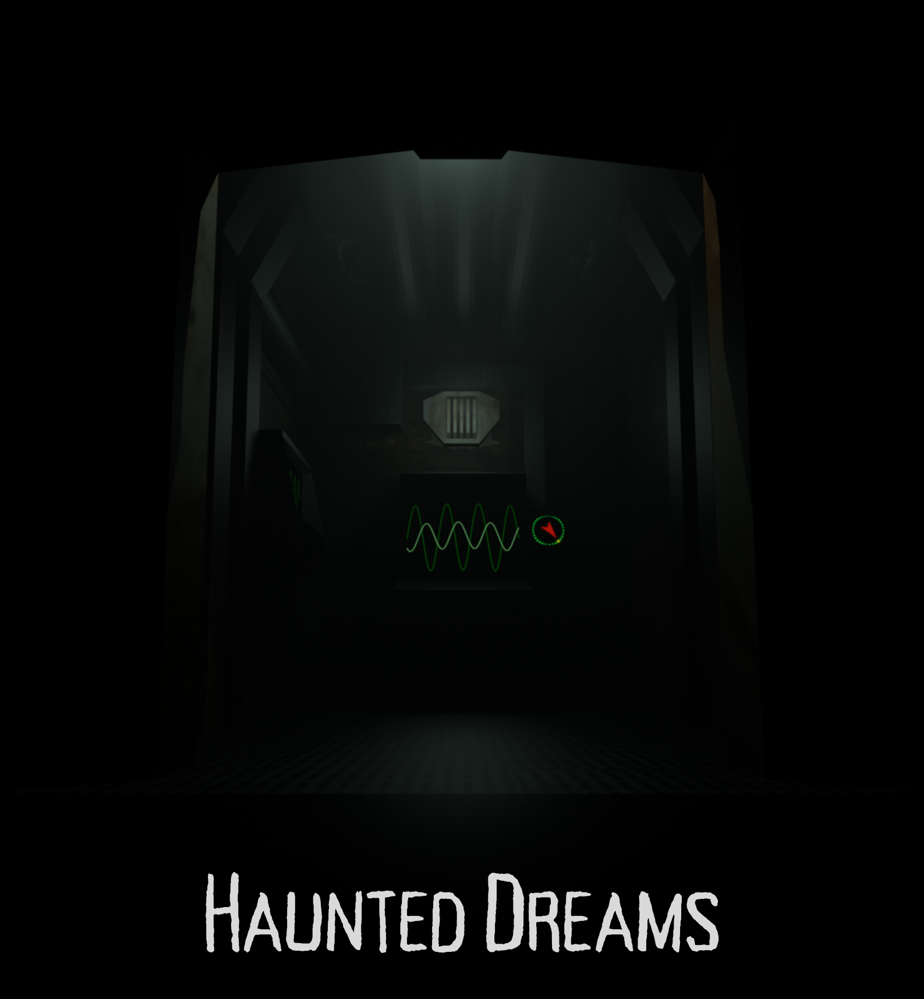

# haunteddreams-gameonweb-contest-24-25

HauntedDream est un jeu d'enquête angoissant et immersif, où vous incarnez un condamné à mort recruté par le mystérieux psychiatre Dunwich. Votre mission : explorer l’esprit brisé d’une patiente internée pour percer le secret qui la hante.

Plongez dans une réalité alternative de 1945, où la science a ouvert les portes du subconscient. Grâce à une technologie révolutionnaire, vous serez projeté au cœur des cauchemars de cette âme tourmentée. Mais attention, ce voyage est aussi périlleux qu’insondable. Chaque choix compte, chaque découverte vous rapproche de la vérité… ou de la folie.

Obéissez aux exigences du docteur, extirpez-lui les informations qu’il cherche et peut-être, juste peut-être, échapperez-vous à votre funeste destinée. Oserez-vous défier l’horreur alors encore inexplorée, au prix de votre liberté ?

[Voir le trailer sur YouTube](https://www.youtube.com/watch?v=PME4RAuYcyg)

[Voir la vidéo du gameplay](https://youtu.be/XcnTnza_S-c)

[Voir la vidéo de présentation]()

Ce jeu est développé dans le cadre du concours [Games On Web 2025](https://www.cgi.com/france/fr-fr/event/games-on-web-2025) organisé par [CGI France](https://www.cgi.com/france/fr-fr). 

Consulter notre [repo Github](https://github.com/BarbaTeam/Haunted-Dreams).

## Comment jouer
Le jeu est encore en développement, et est disponible sur la plateforme [itch.io](https://deyann.itch.io/haunteddreams) (cliquez sur le lien pour jouer)

Finalement, nous vous recommandons de mettre le jeu en plein écran avant de cliquer sur "jouer" grâce à l'icone en bas à droite. N'hésitez pas à changer les quelques paramètres disponibles et prenez un casque ! 

## Remarques et recommandations
Nous avons remarqué une assez mauvaise performance sur le navigateur firefox. Nous vous recommandons d'utiliser un navigateur tel que chrome, ou brave. 

Itch.io nous donne une limite de taille pour notre jeu, ce qui nous a poussé à retirer la version anglaise qu'on avait implémenté.

## Documentation

- [🎮 Comment jouer](JOUER.md)
- [📚 Explication du lore](LORE.md)
- [💡 Solution des énigmes](SOLU.md)
- [🔧 Installation](INSTAL.md)
- [📷 Photos](PHOTOS.md)
- [🎵 Bande originale](https://soundcloud.com/majurax/haunted_dreams_main_theme)
